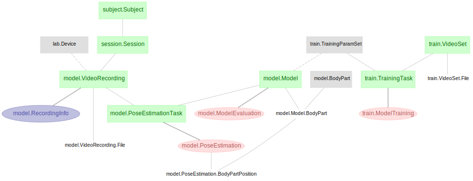

# DataJoint Element - DeepLabCut

This repository features a draft of a DataJoint pipeline design for behavior tracking
and pose estimation via ***DeepLabCut***. This project is a part of our U24 initiative.

The pipeline presented here is not a complete pipeline by itself, but rather a modular
design of tables and dependencies specific to the behavior tracking workflow. This
modular pipeline element can be flexibly attached downstream to any particular design of
experiment session, thus assembling a fully functional behavior pipeline (see the
example [workflow-deeplabcut](https://github.com/datajoint/workflow-deeplabcut)).

This Element currently supports single-animal, single-camera 2D models, and does not yet support multi-animal or multi-camera models.

## The Pipeline Architecture



As the diagram depicts, the DeepLabCut element starts immediately downstream from ***Session***, with the following tables.

+ ***VideoRecording***: All recordings from a given session.
+ ***ConfigParamSet***: A collection of model parameters, represented by an index.
+ ***TrainingTask***: A set of tasks specifying models to train
+ ***ModelTraining***: A record of training iterations for a given model.
+ ***Model***: A central table for storing unique models
+ ***ModelEval***: Evaluation parameters for each model
+ ***BodyPart***: Unique body parts and descriptions thereof (a.k.a. joints) in a given model.
+ ***PoseEstimationTask***: A series of pose estimation tasks to be completed. This is where one would list videos of experimental sessions.
+ ***PoseEstimation***: Results of pose estimation using a given model. The part table here has a method for directly fetching the results as a pandas dataframe.

A ***Device*** table must be declared elsewhere to uniqely identify cameras.

## Installation

+ Install `element-deeplabcut`
    ```
    pip install element-deeplabcut
    ```

+ Upgrade `element-deeplabcut` previously installed with `pip`
    ```
    pip install --upgrade element-deeplabcut
    ```

+ Install `element-data-loader`

    + `element-data-loader` is a dependency of `element-deeplabcut`, however it is not contained within `requirements.txt`.

    ```
    pip install "element-data-loader @ git+https://github.com/datajoint/element-data-loader"
    ```

Note that deeplabcut itself requires a dependency called numba as part of `trackingutils.py`. Numba requires numpy<=1.2. This may conflict with installs of other DataJoint elements, which rely on nwb-conversion-tools, itself requiring numpy>=1.21.0.

## Usage

### Element activation

To activate the `element-deeplabcut`, one needs to provide:

1. Schema names
    + schema name for the dlc module
    + optional: schema name for the treadmill module

2. Upstream tables
    + Session table

3. Utility functions
    + get_beh_root_data_dir()
    + get_session_directory()
    + optional: get_beh_root_output_dir()

For more detail, check the docstring of the `element-deeplabcut`:
```python
help(dlc.activate)
```
### Example usage

See [this project](https://github.com/datajoint/workflow-deeplabcut) for an example usage of this DeepLabCut Element.
